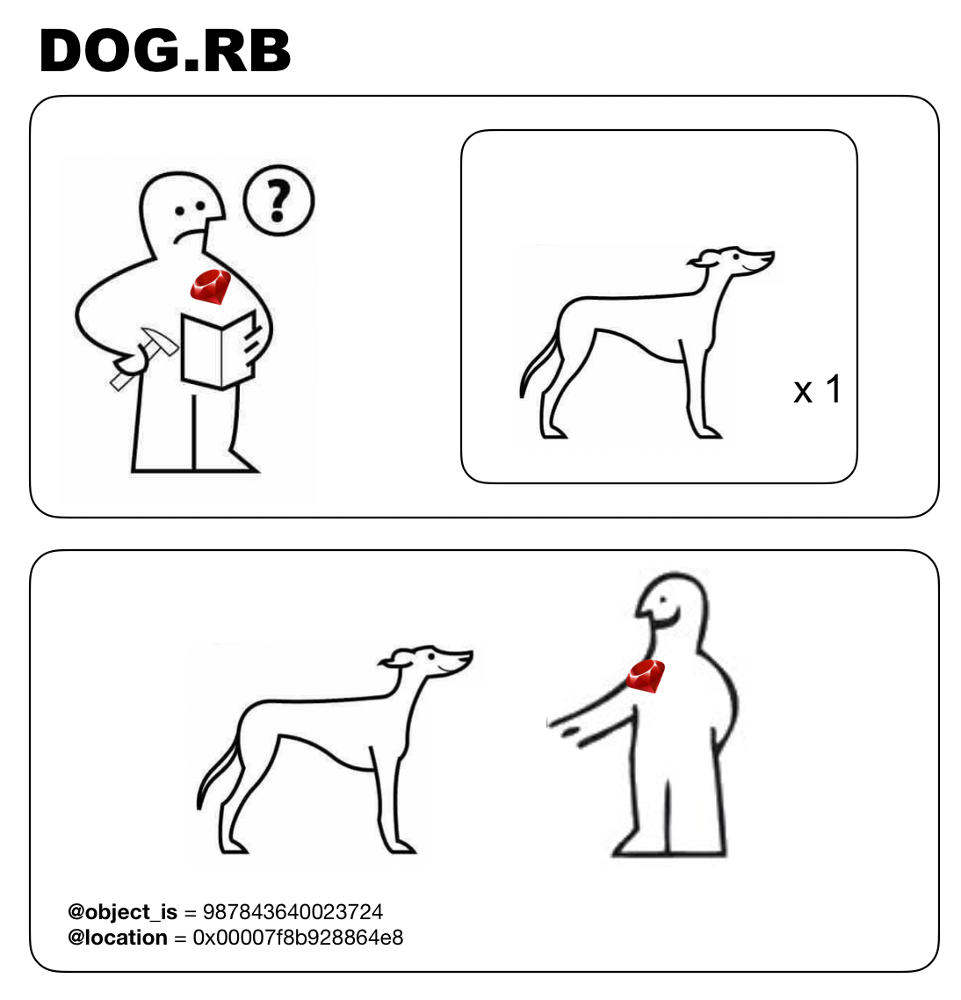
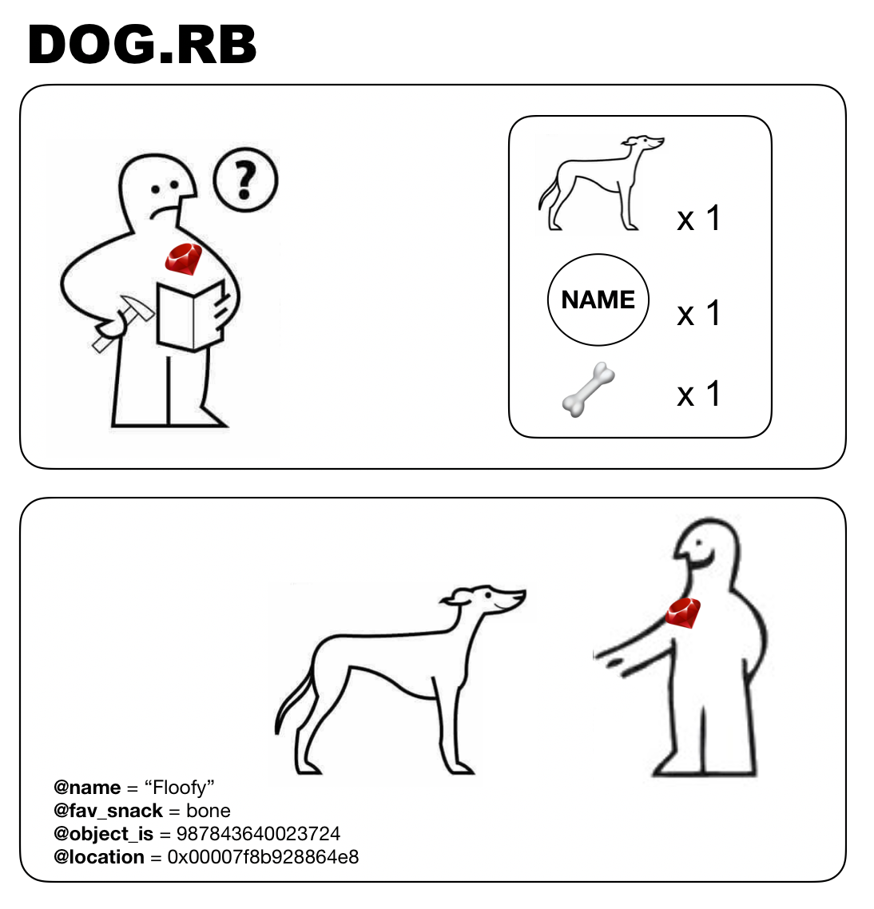
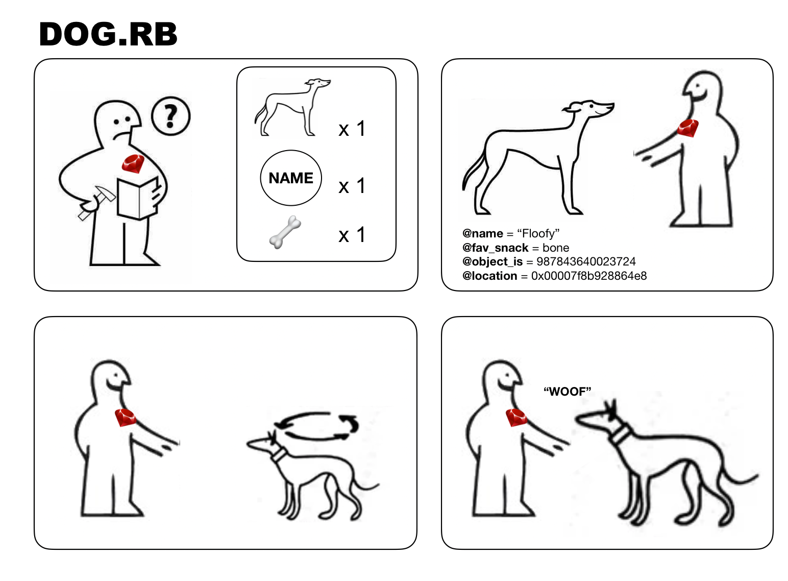

## Classes, Instances, Attributes

## Learning Goals:
- [ ] Pass arguments to `new` by defining an `initialize` method in class
- [ ] Define instance variable
- [ ] Define attribute readers and writers
- [ ] Use `attr_` macros instead of reader and writer methods
- [ ] Add behavior to a class instance

## Analogy time 
We no longer create a hash every single time we want to create a dog object. Instead, we created a blueprint (the `Dog class`) for Ruby to do the job for us. For this lecture imagine Ruby as an elf who assembles together gifts for kids:


Our elf needs to assemble thousands of different objects and each time checks the manual attached to them. For instance, when we tell Ruby to create a dog:
```ruby
    floofy = Dog.new
```
this is what might be happening:


## Pass arguments to `new` by defining an `initialize` method in class
* Every dog needs some info:
    * fav_snack
    * name 

    ```ruby
    def initialize(name_argument, fav_snack_argument)
        @name = name_argument
        @fav_snack = fav_snack_argument
    end
    ```

    How we assign those values? Let's add some attributes to the manual:
    


    * What is `@fav_snack`? //instance variable
    * Define instance variable
    * `floofy.fav_snack = “bone"`
    * `floofy.fav_snack`

    Now, try getting only the name:
    ```ruby
        floofy = Dog.new("Floof", "corgi")
        puts floofy
        puts floofy.name
    ```

## Define attribute readers and writers
* How do we access these values?
    * Getter method allows us to only read the value
    ```ruby
    def fav_snack
    @fav_snack
    end
    ```

    * Setter/writer method allows us to overwrite the value;
    ```ruby
    def fav_snack=(fav_snack)
        @fav_snack = fav_snack
    end
    ```

    * Confused what method to write?
        * if you want to have an access to an attribute but don't want to change its value later -> getter/reader method
        * if you want to have an opportunity to change the attribute's value -> setter/writer method
        * if you want to have both an access and an ability to change its value -> both


## Use `attr_` macros instead of reader and writer methods
* To read attributes: `attr_reader`
* To write attributes: `attr_writer`
* For reading & writing: `attr_accessor`

## Add behavior to the dog instance
Our dog can already bark, now let's make it spin. 
 
