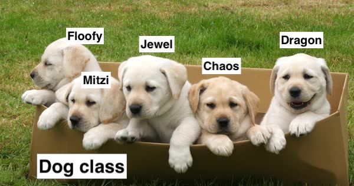

# Class & Methods

## Post lecture
Here's <a href="https://flatironschool.zoom.us/rec/play/7J0pJuH7-z83H4GX5QSDBf8vW9W7Lq6s0CBM-vpezE2wAncKMVGjY7YSYubfOz98OlhyYL_mwFjsoFOv?continueMode=true"> the lecture video </a>
Here's <a href="https://github.com/learn-co-students/nyc04-seng-ft-071320/blob/master/07-intro-to-oo-in-ruby//Users/sylwiavargas/access-labs/nyc04-seng-ft-071320/09-self-class-methods-class-variables/W1-Wed-Self-class-methods.txt"> the lecture chat </a>

## LGs:
- [x] Revise what we did yesterday: create a class and an instance with data (attributes) and instance methods (a behavior)
- [ ] Create class methods
- [ ] Check what `self` is
- [ ] Call methods on the implicit or explicit `self`
- [ ] Explain the difference between `variable`, `@variable` and `@@variable`

## Create instance methods and class methods
* What is an **instance method**?
    * "An instance method provides functionality to one instance of a class. A method that we run on an instance"
* Create methods that display message about an instance (a dog)
```ruby
    def bark
        puts "woof"
    end
```
We invoke it by chaining it to the Dog variable: `chaos.bark`

* What is a **class method**?
    * Now, we need to store all our objects in one place. Let's create a class variable (`@@all`) that will become a box in which we can put all instance variables:
    ```ruby
        class Dog
            @@all = []
        end
    ```
    Let's think about this variable as if it were a big box for the instances:
    
    * "A class method provides functionality to a class itself. A method that we run on a class and method's name start with self."
    * Let's create a method that when called on the class, will return the variable:
    ```ruby
        def self.all
            @@all
        end
    ```


## Be able to check what `self` is
* What is `self`?
    * "`self` is a special variable that points to the object/class that "owns" the currently executing code."
* Let's check what `self` is in the `initialize` method
* Let's add each new dog to the box of all dogs:
```ruby
    def initialize(name_arg, breed_arg)
        @name = name_arg
        @breed = breed_breed
        @@all << self
    end
```
Now, after we've run this method a couple of times, we will have a couple of instances in that array:
    

```ruby
    Dog.all
# => [#<Dog:0x00007fad90835500 @breed="bone", @name="chaos">,#<Dog:0x00007fad8e27f6f8 @breed="bone", @name="Mitzi">,#<Dog:0x00007fad8e3963e8 @breed="fish", @name="Jewel">,#<Dog:0x00007fad8f11cb70 @breed="snacks", @name="Chaos">]
```

## Let's see the difference between the two:
```ruby
def who_am_i
    puts "I am #{self}"
end

def self.who_am_i
    puts "I am #{self}"
end
```
* how do we know what `self` is? Look where it's placed: if it's placed only inside a method body, `self` will be what you call the method on; if it's placed in the class (e.g. in the method name), `self` will denote the class;
    * if you want your method to act on the whole class -- name it beginning with `self` (e.g. `self.all`)
    * if you want your method to act on an instance -- you just need the method name (e.g. `bark`)

Now, will any of these work?
```ruby
def who_am_i
    puts "I am #{self.name}" #this is an example of explicit self
    puts "I am #{name}" #implicit self: name is actually a method given in attr_accessor that returns the instance variable @name
    puts "I am #{@name}" #no self is called in this case: it is just an instance variable
    puts "I am #{self.@name}" #this won't work because there's no method called "@name" not can there be as "@" is reserved for instance variables
end
```

## Call methods on the implicit or explicit `self`
* What is explicit self?
    * "Using `self` keyword use class/object properties"
* What is implicit self?
    * "If you call a method in the same object as the context without mentioning `self`, that's implicit self."
* Which one to use? It's your preference! 


## Variable vs instance variable vs class variable
- `variable` -> this is just standard locally-scoped variable that disappears as soon as the method encapsulating it runs; 
- `@variable` -> this is an instance variable containing its individual data; as long as the instance exists, the instance will carry this variable with itself (e.g. if it's a dog, think about its medallion on its collar) -- this data is available only to the instance;
- `@@variable` -> this is a class variable; it is used to e.g. store all the instances (think of the box with puppies); 

Read more about variables [here](https://medium.com/swlh/hitchhikers-guide-to-ruby-variables-1b4cf83d540c)

