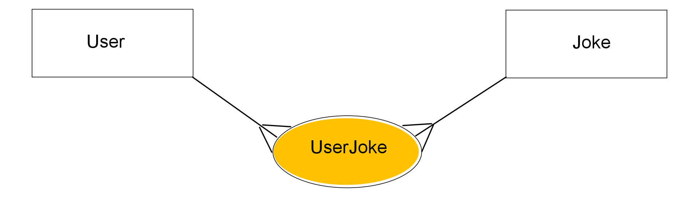

# Joke App Source Code

## Learning goals
* [ ] Navigate foreign source code
* [ ] Understand how to use modules in your code
* [ ] See examples of single responsibility principle
* [ ] Explain what "guard clause" is

### Domain model

User -< UserJoke >- Joke

### Get started
0. **IMPORTANT**: `cd pre_lecture_kit` and open in VS Code
1. Bring gems: `bundle`
2. Run migrations: run `rake db:migrate`
3. Load seeds: run `rake db:seed`
4. Read the seed file
5. Check what rake tasks are available by running `rake -T`; notice that the console task is called something else than what you're used to
6. In console check first user's fav jokes just to make sure it works
7. Read the schema just to see what attributes each model has
8. Start the app through a rake task (check `rake -T`): 
- go through it once to see how stuff connects 
- and then second to **try to break it**
9. Now, read the code and see try to understand how things connect -- read it carefully, **do not give up if the syntax feels foreign** (ask a peer, ask in the cohort channel):
- `app/joke_app.rb`
- `app/models/joke.rb`
- `app/models/user.rb`
- `app/models/fav_joke.rb`
- `app/tools/themes.rb`
- `app/tools/cli_controls.rb`
- `app/tools/colors.rb`

**FEEL FREE TO EXPLORE IT: put a `binding.pry` wherever you want!**

10. Write down all your questions.

## Read more
- read Eric the Dad's blog [on ancestry, inheritance and modules in Ruby](https://medium.com/@hyeokjungkim/ruby-ancestry-d7f5d808e7d7)