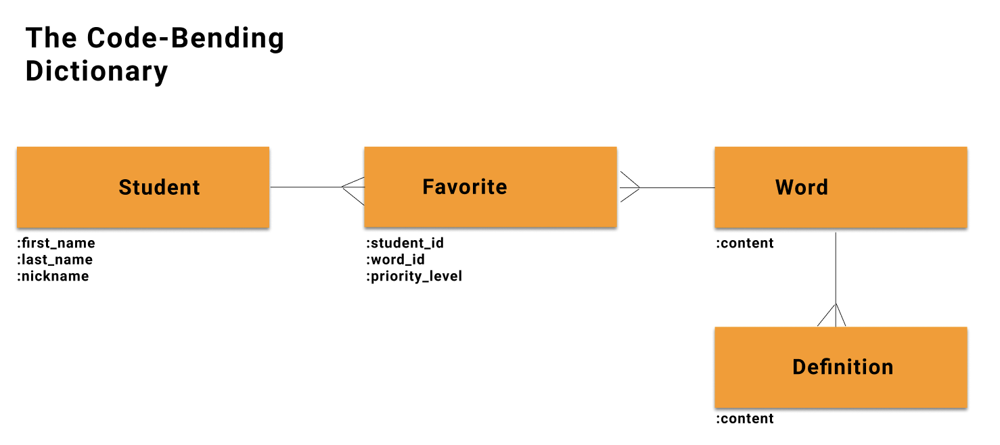

# Read in Rails

## Table of contents
- [Mod2 what we will be building 🔧](#mod2-what-we-will-be-building)
- [Learning Goals 📚](#learning-goals)
- [Self-check after-lecture questions 🧐](#self-check-after-lecture-questions)
- [Rails folder structure 🏠](#rails-folder-structure)
- [Rails Commands Reference 👾](#rails-commands-reference)

--- 

## Mod2: what we will be building
This mod we will be building a helpful resource for all Code Benders and their friends: a dictionary of confusing tech terms. You are all invited to join in -- initially by submitting definitions or words, and afterwards, as contributors to this open source project.

We will add to this app every lecture, step by step, and we will come back to it again in Mod3.

---
 
## Learning Goals
* Create a new Rails application
* Generate a model
* Create routes
* Generate a controller
* Create actions/methods for a RESTful controller
* Create views

---

## Self-check after-lecture questions
Please read these questions carefully **before** the lecture so that you will know what to pay attention to **during** the lecture.

1. How does an angry squid and ice cream relate to Rails?
2. What’s the `byebug` and where can I play with it?
3. What are the steps involved in starting a Rails project from scratch?
4. What do `rails g migration`, `rails g model`, `rails g controller` methods do? Can I reverse them?!
5. What are a `show` and an `index` action for?
6. How does Rails know what controller to use when I type `localhost:3000/students`?
7. What are and where are params coming from?
8. What is dynamic routing and why is it awesome?
9. How can I bring information from a database to the views?
10. Of what instance are the instance variables used in controllers?
11. What is Rails tool for generating `<a href>` tags that know about our database?

--- 

## Rails folder structure
`rails new` generates a lot of files. It may feel overwhelming. Good news for you is that you won't be touching majority of these files. Here's a guide of what you need to become familiar with and where to find it (ordered from the bottom to the top):
- `Gemfile` -- a file responsible for gems; it's located in the "root" directory (not in any folder)
- `Readme` -- a documentation of your project; it's located in the "root" directory (not in any folder)
- `db` -- database folder (e.g. seeds, migrations, schema)
- `config/routes` -- a file dedicated to creating routes
- `app/views` -- a folder where you'll place all the **folders** for each of the model to store ERB files (named accordingly to the methods in controller) and `layouts` (default styling, we will talk about it next week)
- `app/controllers` -- a folder where you'll place all your controllers
- `app/models` -- a folder where you'll place all your models
- `app/assets` -- this is where you'd place css stylesheets (we will talk about it twice in weeks 2 and 3)

---

## Rails Commands Reference
* `rails new <app-name>` - create a new Rails app
* `rails c` - open a console
* `rails s` - start server
* `rails g migration <migration-name> <attribute:data-type> <attribute:data-type>` - generate a migration
* `rails g model <model-name> <attribute:data-type> <attribute:data-type>` - generate a model and a migration to create the table with specified columns
* `rails g controller <model-name-pluralized>` - generate a controller
* `rails routes` - display all the routes in your app, also can viewed at http://localhost:3000/rails/info/routes
* `rails db:migrate` - run all pending migrations (same as `rake db:migrate` in Mod1)