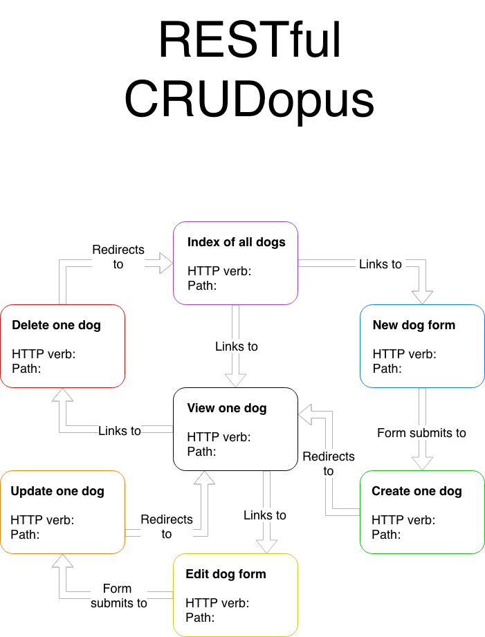

# CRUD in Rails

## Post-lecture
- [video](https://flatironschool.zoom.us/rec/share/x9NsC6r--VtJYZGO5AbgC5MZBtniX6a81nce-qAFzht1BLaDM18fs_iNpJku3nG4?startTime=1598464952000)
- [chat](https://github.com/learn-co-students/nyc04-seng-ft-071320/blob/master/21-crud-in-rails/M2W1D3.txt)
- [slides](https://docs.google.com/presentation/d/1nvHO7oUfWKUgU3qF25couGCIJuNaHAkvTWGzfernVKQ/edit?usp=sharing)

## Table of contents
- [Learning Goals 📚](#learning-goals)
- [Self-check after-lecture questions 🧐](#self-check-after-lecture-questions)
- [Outline 🗺](#outline)
- [Helpful Bookmarks 🤓](#helpful-bookmarks)
- [CRUDopus 🐙](#crudopus)
- [Rails process for new actions 🌮](#rails-process-for-new-actions)
- [Rails Commands Reference 👾](#rails-commands-reference)
- [Controller and Routes Reference 🕹](#controller-and-routes-reference)
  - [Controller](#controller)
  - [Routes](#routes)


## Learning Goals
- Explain how routes in Rails interact with the controller
- Use ActionView helpers like `link_to`, `button_to` and `form_for` to help write HTML
- Use **strong params** to allow creating/updating models with mass assignment
- Create, Update and Delete with Rails

---

## Outline
- [ ] Work on CRUD, focus on routes and ActionView helpers
  - [ ] Read
    - [ ] Review `link_to` and path helpers
  - [ ] Create
    - [ ] HTML form vs `form_for`
    - [ ] Strong Params
  - [ ] Update
    - [ ] reusable `form_for`
  - [ ] Delete
    - `button_to`

---

## Self-check after-lecture questions
Please read these questions carefully **before** the lecture so that you will know what to pay attention to **during** the lecture.

1. How many arguments does the `link_to` method take in? What are these arguments?
2. What is a path helper?
3. Why `students_path` does not need an `id` but `student_path` needs one?
4. Why are there two routes needed for creating a new instance?
5. Why do we redirect?
6. What are two ways Rails prevents our app from getting hacked?
7. What method does `button_to` default to?

---

## Helpful Bookmarks
- slide deck: <https://docs.google.com/presentation/d/1nvHO7oUfWKUgU3qF25couGCIJuNaHAkvTWGzfernVKQ/edit?usp=sharing>
- [restular](http://www.restular.com/)

---

## CRUDopus



--- 

## Rails process for new actions
1. new route
2. add action in the controller
3. add a view
4. test it manually online

---

## Rails Commands Reference
* `rails new <app-name>` - create a new Rails app
* `rails c` - open a console
* `rails s` - start server
* `rails g migration <migration-name> <attribute:data-type> <attribute:data-type>` - generate a migration
* `rails g model <model-name> <attribute:data-type> <attribute:data-type>` - generate a model and a migration to create the table with specified columns
* `rails g controller <model-name-pluralized>` - generate a controller
* `rails routes` - display all the routes in your app, also can viewed at http://localhost:3000/rails/info/routes
* `rails db:migrate` - run all pending migrations (same as `rake db:migrate` in Mod 1)

---

## Controller and Routes Reference

### Controller
```ruby
class StudentsController < ApplicationController

  # get '/students'
  def index
    # digesting the request: checking in with the model to get the student array
    @students = Student.all
    # response: render an index view
    render :index
  end

  # get '/students/new'
  def new
    # digesting the request: creating an empty template for the form
    @student = Student.new
    # response: render new form view
    render :new
  end
  
  # post '/students'
  def create
    # digesting the request: going through the params hash and checking in with the model to create a new instance
    student_params = params.require(:student).permit(:first_name, :age, :last_name)
    @student = Student.create(student_params)
    # response: redirect to the '/students', which will trigger the index action
    redirect_to students_path
  end

  #get '/students/:id/
  def show
    # digesting the request: finding a student in a model
    @student = Student.find(params[:id])
    # response: render show view
    render :show
  end

  # get '/students/:id/edit'
  def edit
    # digesting the request: crompiling data for the form from the model
    @student = Student.find(params[:id])
    # response: render edit form view
    render :edit
  end

  # patch '/students/:id'
  def update
    # digesting the request: going through the params hash and checking in with the model to update a the instance
    @student = Student.find(params[:id])
    student_params = params.require(:student).permit(:first_name, :age, :last_name)
    @student.update(student_params)

    # response: redirect to the '/students/:id', which will trigger the show action
    redirect_to student_path(@student)
  end

  # delete '/students/:id"
  def destroy
    # digesting the request: checking in with the model to find a student instance and destroy it
    @student = Student.find(params[:id])
    Student.destroy(params[:id])
    #response: redirect to the index page
    redirect_to students_path
  end

end
```

### Routes

```ruby
    get '/students', to: 'students#index', as: 'students'
    get '/students/new', to: 'students#new', as: 'new_student'
    post '/students', to: 'students#create'
    get '/students/:id', to: 'students#show', as: 'student'
    get 'students/:id/edit', to: 'students#edit', as: 'edit_student'
    patch 'students/:id', to: 'students#update'
    delete 'students/:id', to: 'students#destroy'

    # or, if you will have all seven routes or don't want to practice the syntax:
    # resources :students
    # resources :students, only: [:index, :show]
```