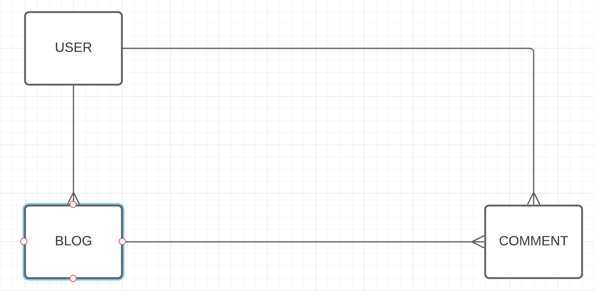
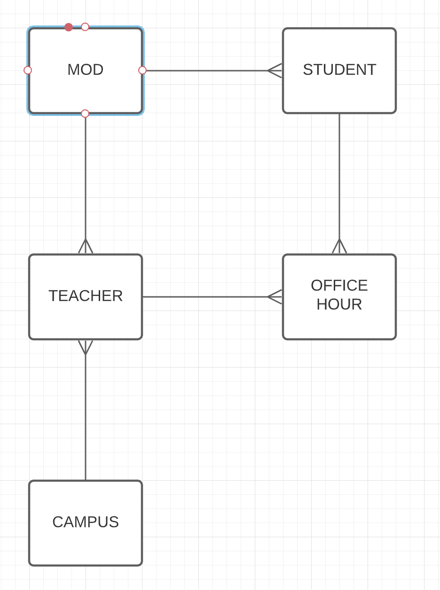

# How to Draw Your ERDs

1. Start with a single model that your app is based-around. Oftentimes, this is the model who is going to be driving most of the user stories.
2. Consider the first model's relationship with the second model. Ask yourself: 
    - In my application, what should be the relationships? 
    - Is it a many to many? A has_many/belongs_to?
3. Add in whatever necessary model to support the relationship and consider the placements of the foreign keys.
    - If Model B belongs to Model A, it is the responsibility of Model B to know which Model A it belongs to.
    - This means that Model B needs to have a foreign key for Model A.
    - Foreign keys are singular. So, it is `word_id` and NOT `words_id`.
    - In the ERD diagram, the model at the end of the "chicken feet" denotes the object that needs to have the foreign keys.
    - You cannot have a many to many without a joiner model.
4. Repeat steps 2 and 3 for other models.

# Generate Your Migrations

1. Start with your independent models - The model without any dependencies/foreign_keys.
2. Work your way up, saving the model with the most number of dependencies until the end.

# ActiveRecord Macros

- Conventionally, a `has_many` should always be followed by the plural name of the object. 
    - `has_many :words` and NOT `has_many :word`
    - The instance method that the `has_many` gives us will ALWAYS return an array of instances. 

- Conventionally, a `belongs_to` should always be followed by the singular name of the object. 
    - `belongs_to :word` and NOT `belongs_to :words`
    - The instance method that the `belongs` gives us will ALWAYS return a single instance.
    - You cannot write `belongs_to :word, through: :x`.

# EXAMPLE 

- Mod Model:
    * No Foreign Key

- Student Model: 
    * Needs a Foreign Key of Mod

- OfficeHour Model:
    * Needs a Foreign Key of Student
    * Needs a Foreign Key of Teacher

- Teacher Model: 
    * Needs a Foreign Key of Mod
    * Needs a Foreign Key of Campus

- Campus Model:
    * No Foreign Key